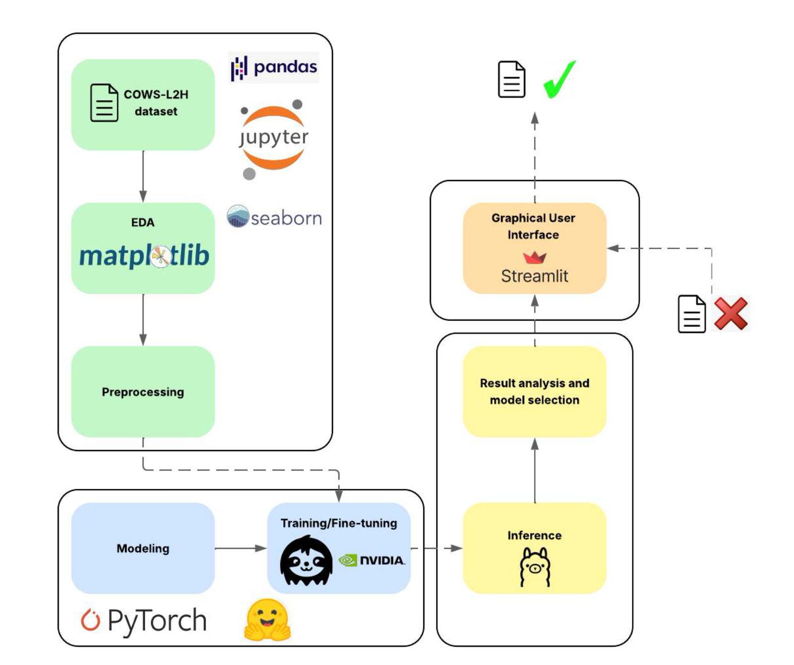

# TFG AI applied to Grammar Error Correction

This repository contains the data, code and models used for the Final Degree Project in Data Science and Engeneering.

The main objective of this work was to build an easily using UI for correcting grammar errors in student essays. For more information about the project see the [Report file](TFG_report.pdf).

### Workflow of the project

<p align="center">
  
</p>

### How to execute

Ensure requirements are installed and then run:

```shell
streamlit run ui.py